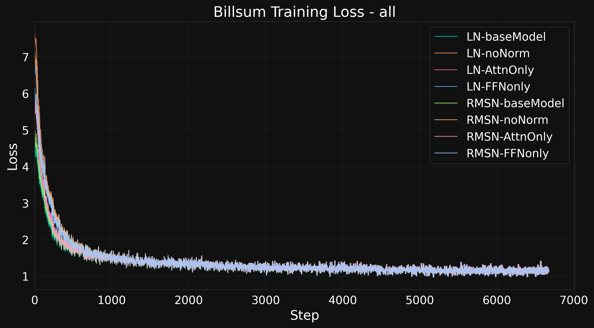
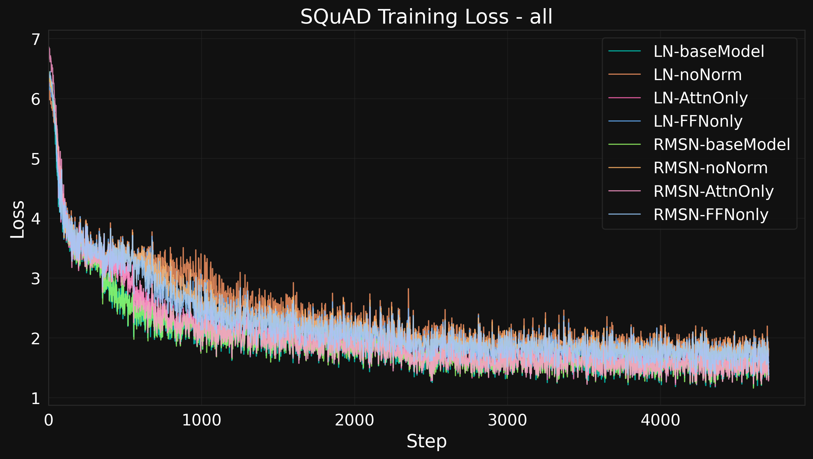
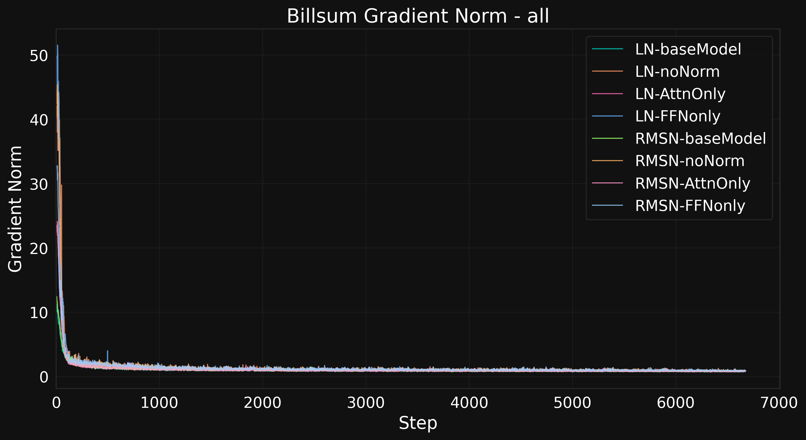
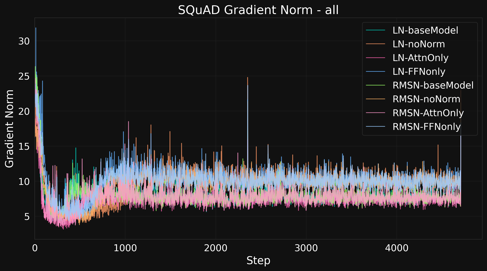

# nanoGPT-Valkyrie — GPT-2 Normalisation Study

Research code, model checkpoints, and experimental results for my IB Computer Science Extended Essay:

**The Impact of Layer Normalisation Methods on Training Effectiveness and Performance of Decoder-Only Transformer Architectures**

I pre-trained GPT-2 models with 124 million parameters on FineWeb-Edu. I compared normalisation methods, tested changes to their placement, and evaluated the models on three tasks.


*Four normalisation layouts, applied to LayerNorm and RMSNorm models.
The final normalisation layer remains in every variant.*



*The eight variants converge to similar BillSum training loss values.*

The work covers distributed training, custom normalisation code, checkpoint recovery, fine-tuning, and statistical analysis.

**Research period:** August 2024–January 2025  
**IB Computer Science Extended Essay result:** Grade A

- [Read the paper](Extended%20Essay%20-%20Transformers.pdf)
- [Backup copy on Google Drive](https://drive.google.com/file/d/1dlhTgv4-A2cCYSsL00An_XpfGpg1DyWy/view)
- [Training code](pretraining/)
- [Evaluation and statistics](analysis/statistics/)
- [Model checkpoints](#model-checkpoints)

## Video walkthrough

I recorded this walkthrough for Hack Club. It covers the repository,
the data download, and the GPU setup.
The video shows the original directory layout.

[Watch the GPT-Valkyrie walkthrough — 8:18 to 24:53](https://www.youtube.com/watch?v=mP4dqV3jQZ4&t=498s)

## Research question

How do normalisation methods affect the speed and stability of GPT-2 pre-training?

How do pretrained models respond when selected normalisation layers are removed, before and after task fine-tuning?

The study compares three methods:

- **LayerNorm (LN):** normalisation through the mean and variance.
- **RMSNorm (RMSN):** normalisation through the root mean square.
- **PowerNorm (PN):** normalisation through running quadratic statistics.

## Main results

### Pre-training

LayerNorm and RMSNorm reached similar training loss. RMSNorm achieved approximately 6% higher throughput in these experiments.

| Method | Final training loss | Reported throughput | Outcome |
|---|---:|---:|---|
| LayerNorm | Approximately 3.4 | 1.225 million tokens/s | Converged |
| RMSNorm | Approximately 3.4 | 1.3 million tokens/s | Converged |
| PowerNorm | Approximately 9.7 | — | Gradient explosion |

PowerNorm failed in the tested implementation and configuration. An additional group-scaling step did not prevent the failure.

A separate GPU comparison tested one, four, and six NVIDIA H100 GPUs. Four GPUs achieved the highest total throughput: **1.27 million tokens/s**.

The GPU comparison and the full normalisation runs are separate measurements. The paper reports them on pages 23 and 40–44.

### Normalisation ablation

The study created variants of the pretrained LayerNorm and RMSNorm models.

The ablation code replaces selected normalisation layers with an identity function. This function returns its input without a change.


*Figure 15 from the paper. The diagram shows normalisation positions
within the transformer blocks.*

| Variant | Normalisation before attention | Normalisation before the feedforward network |
|---|---|---|
| `baseModel` | Retained | Retained |
| `AttnOnly` | Retained | Removed |
| `FFNonly` | Removed | Retained |
| `noNorm` | Removed | Removed |

The final normalisation layer, `ln_f`, remains in all four variants.

The reported results show:

- Text quality degraded sharply after ablation without further fine-tuning.
- After BillSum or SQuAD fine-tuning, many score comparisons showed similar distributions across the variants.
- Some variants with less normalisation achieved higher mean task scores.
- The experiments showed no clear reduction in fine-tuning time.

These experiments examine changes to pretrained models. They do not establish that every ablated configuration can train successfully from random initialisation.

### Fine-tuning loss

The eight LayerNorm and RMSNorm variants converge to similar training
loss values on BillSum.




*The SQuAD loss curves show greater separation between the variants
than the BillSum curves.*

### Gradient norms during fine-tuning

The following plots compare gradient norms across the eight model
variants during task fine-tuning.



*BillSum gradient norms decrease sharply during the initial steps.*



*SQuAD gradient norms show persistent fluctuations and differences
between variants.*

## Model and training setup

| Property | Configuration |
|---|---|
| Architecture | GPT-2, decoder-only transformer |
| Model size | Approximately 124 million parameters |
| Transformer blocks | 12 |
| Attention heads per block | 12 |
| Hidden dimension | 768 |
| Context length | 1,024 tokens |
| Pre-training dataset | FineWeb-Edu, `sample-10BT` |
| Main hardware configuration | Four NVIDIA H100 GPUs |
| Distributed training | PyTorch DistributedDataParallel |
| Precision | bfloat16 autocast and reduced matrix-multiplication precision |
| Compilation | `torch.compile` |

The data pipeline tokenises the corpus and stores it in shards. The training code supports gradient accumulation and gradient clipping.

Checkpoints store the model, optimizer, training step, and data-loader positions. They also retain the Weights & Biases run identifier for experiment recovery.

The PowerNorm adaptation includes a custom backward pass and distributed synchronisation of its statistics.

## Evaluation

The study evaluates eight LayerNorm and RMSNorm variants across three tasks.

| Task | Dataset or input | Evaluation |
|---|---|---|
| Text generation | 25 prompts | GPT-4o assessments |
| Summarisation | BillSum, California test set | ROUGE-1, ROUGE-2, ROUGE-L, BLEU, and GPT-4o assessments |
| Question answering | SQuAD v2 | F1, exact match, and GPT-4o assessments |

The GPT-4o evaluation contains **600 assessments**:

**8 variants × 3 tasks × 25 samples**

The saved records contain model outputs, scores, and written explanations.

The statistical analysis uses:

- Kruskal–Wallis tests.
- Dunn pairwise comparisons with Bonferroni correction.
- Effect-size estimates.

Gradient plots compare the models before and after fine-tuning. The repository also preserves earlier ANOVA and Tukey analysis.

The paper explains the evaluation method, results, and study limits. Its appendices contain the prompts, code, model links, and sample assessment records.

## Repository guide

| Location | Contents |
|---|---|
| [Paper](Extended%20Essay%20-%20Transformers.pdf) | Final paper, references, and appendices |
| [Pre-training](pretraining/) | LayerNorm, RMSNorm, PowerNorm, and PowerLayerNorm implementations |
| [Ablation](ablation/) | Scripts that remove selected normalisation layers |
| [Evaluation](evaluation/) | Task fine-tuning, text generation, metrics, and GPT-4o assessment |
| [Analysis](analysis/) | Statistical tests, training curves, gradients, and attention analysis |
| [Results](results/) | Saved outputs, scores, CSV exports, statistical results, and figures |
| [Experiments](experiments/) | Dated implementation tests and intermediate experiments |
| [References](references/) | Reference implementations and source notebooks |
| [Notes](docs/notes/) | Research notes and original cloud commands |
| [Paper drafts](docs/paper-drafts/) | Earlier paper versions and outline |
| [Earlier projects](related/) | Three related repositories, included as Git submodules |

The paper describes the final methods and conclusions.
The experiments directory also preserves intermediate tests.

The source files retain their original experiment paths and environment settings.
Some paths refer to the previous layout or original cloud machines.
Update these paths before you run the scripts or notebooks.

### Additional experiments

The repository also contains work outside the paper’s main comparison:

- **PowerLayerNorm (PLN):** a hybrid of LayerNorm and PowerNorm with a learned mixing coefficient.
- **Tokenizer comparison:** an experiment with the larger `cl100k_base` vocabulary.
- **Normalisation checks:** comparisons of custom calculations and reference implementations.
- **Model conversion:** tools to convert training checkpoints for Hugging Face.
- **Checkpoint recovery:** experiments with model state and data-loader restoration.

## Model checkpoints

The model collection contains eight base or ablated variants. BillSum and SQuAD fine-tuning add sixteen task-specific variants.

| Normalisation | Variant | Before task fine-tuning | BillSum | SQuAD |
|---|---|---|---|---|
| LN | `baseModel` | [Model](https://huggingface.co/shng2025/GPT-Valkyrie_LN-124m__baseModel__) | [Model](https://huggingface.co/shng2025/GPT-Valkyrie_LN-124m__baseModel__Billsum) | [Model](https://huggingface.co/shng2025/GPT-Valkyrie_LN-124m__baseModel__SQuAD) |
| LN | `AttnOnly` | [Model](https://huggingface.co/shng2025/GPT-Valkyrie_LN-124m__AttnOnly__) | [Model](https://huggingface.co/shng2025/GPT-Valkyrie_LN-124m__AttnOnly__Billsum) | [Model](https://huggingface.co/shng2025/GPT-Valkyrie_LN-124m__AttnOnly__SQuAD) |
| LN | `FFNonly` | [Model](https://huggingface.co/shng2025/GPT-Valkyrie_LN-124m__FFNonly__) | [Model](https://huggingface.co/shng2025/GPT-Valkyrie_LN-124m__FFNonly__Billsum) | [Model](https://huggingface.co/shng2025/GPT-Valkyrie_LN-124m__FFNonly__SQuAD) |
| LN | `noNorm` | [Model](https://huggingface.co/shng2025/GPT-Valkyrie_LN-124m__noNorm__) | [Model](https://huggingface.co/shng2025/GPT-Valkyrie_LN-124m__noNorm__Billsum) | [Model](https://huggingface.co/shng2025/GPT-Valkyrie_LN-124m__noNorm__SQuAD) |
| RMSN | `baseModel` | [Model](https://huggingface.co/shng2025/GPT-Valkyrie_RMSN-124m__baseModel__) | [Model](https://huggingface.co/shng2025/GPT-Valkyrie_RMSN-124m__baseModel__Billsum) | [Model](https://huggingface.co/shng2025/GPT-Valkyrie_RMSN-124m__baseModel__SQuAD) |
| RMSN | `AttnOnly` | [Model](https://huggingface.co/shng2025/GPT-Valkyrie_RMSN-124m__AttnOnly__) | [Model](https://huggingface.co/shng2025/GPT-Valkyrie_RMSN-124m__AttnOnly__Billsum) | [Model](https://huggingface.co/shng2025/GPT-Valkyrie_RMSN-124m__AttnOnly__SQuAD) |
| RMSN | `FFNonly` | [Model](https://huggingface.co/shng2025/GPT-Valkyrie_RMSN-124m__FFNonly__) | [Model](https://huggingface.co/shng2025/GPT-Valkyrie_RMSN-124m__FFNonly__Billsum) | [Model](https://huggingface.co/shng2025/GPT-Valkyrie_RMSN-124m__FFNonly__SQuAD) |
| RMSN | `noNorm` | [Model](https://huggingface.co/shng2025/GPT-Valkyrie_RMSN-124m__noNorm__) | [Model](https://huggingface.co/shng2025/GPT-Valkyrie_RMSN-124m__noNorm__Billsum) | [Model](https://huggingface.co/shng2025/GPT-Valkyrie_RMSN-124m__noNorm__SQuAD) |

Separate repositories hold the pre-training run files:

[LayerNorm](https://huggingface.co/shng2025/GPT-Valkyrie_LN-124m) ·
[RMSNorm](https://huggingface.co/shng2025/GPT-Valkyrie_RMSN-124m) ·
[PowerNorm](https://huggingface.co/shng2025/GPT-Valkyrie_PN-124m) ·
[PowerLayerNorm](https://huggingface.co/shng2025/GPT-Valkyrie_PLN-124m)

## Related projects

These repositories contain the earlier stages of this work.
Each Git submodule records a specific commit from its source repository.

| Project | Local directory | Scope |
|---|---|---|
| [GPTesla-Code-Generation](https://github.com/Ice-Citron/GPTesla-Code-Generation) | `related/GPTesla-Code-Generation/` | Python code model, custom tokenizer, and Accelerate training |
| [GPT-Foundations](https://github.com/Ice-Citron/GPT-Foundations) | `related/GPT-Foundations/` | GPT and tokenizer exercises, personal implementations, and notes |
| [GPT2-Reproduction](https://github.com/Ice-Citron/GPT2-Reproduction) | `related/GPT2-Reproduction/` | GPT-2 reproduction, experiment logs, and initial custom LayerNorm implementation |

To download this repository with all three submodules:

```bash
git clone --recurse-submodules https://github.com/Ice-Citron/nanoGPT-Valkyrie.git
```

For an existing clone:

```bash
git submodule update --init --recursive
```

## Background and acknowledgements

Andrej Karpathy’s courses and GPT-2 reproduction provided the foundation for this work. The project adapts that foundation for the normalisation experiments.

- [Karpathy’s GPT-2 reproduction](https://github.com/karpathy/build-nanogpt)
- [Natural Language Processing with Transformers — notebooks](https://github.com/nlp-with-transformers/notebooks)

The PowerNorm implementation builds on the work of Shen and colleagues.

The paper contains the full references on pages 71–77 and acknowledgements on page 78. These also credit the educational resources, infrastructure providers, and AI tools used throughout the project.

## Citation

Ng, Shi Hao. *The Impact of Layer Normalisation Methods on Training Effectiveness and Performance of Decoder-Only Transformer Architectures.* IB Computer Science Extended Essay.

[Full paper](Extended%20Essay%20-%20Transformers.pdf) ·
[Backup copy on Google Drive](https://drive.google.com/file/d/1dlhTgv4-A2cCYSsL00An_XpfGpg1DyWy/view)

## License

This repository uses the [MIT License](LICENSE).
